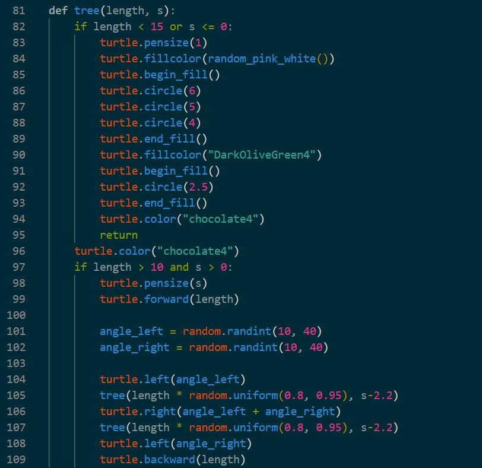
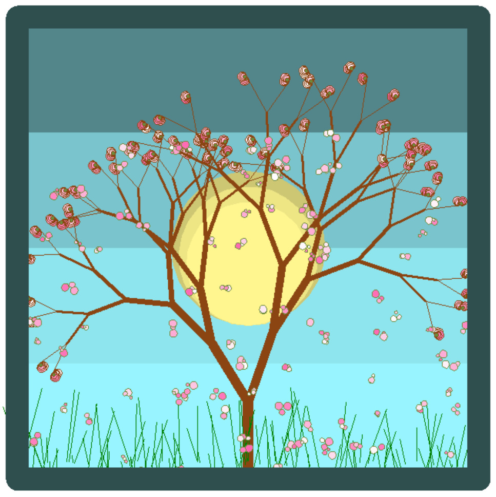

## Recursive Functions (Brief Explanation)

A recursive function is a function that calls itself to solve a problem by breaking it into smaller parts.  
This technique is especially useful for modeling natural structures such as trees, where each part is similar to the whole.  
Every recursive function must have a **base case** to stop the recursion and avoid infinite execution.

---

## Recursive Code Example

The recursive function shown above is responsible for drawing a tree-like structure using Python’s `turtle` module.

- The function calls itself to create smaller branches.
- A **base case** stops the recursion when the branch length becomes too small.
- Random angles and scaling factors are used to make the tree look more natural.
- This approach demonstrates how recursion can be used not only for problem-solving, but also for creative visual designs.

---

## Final Result

The final image is created by combining recursive drawing with randomness, resulting in an organic and visually appealing scene.

---

## Acknowledgment

I would like to express my sincere thanks to **Professor Etemadi** and **Haji Hosseini** for their guidance and support.
